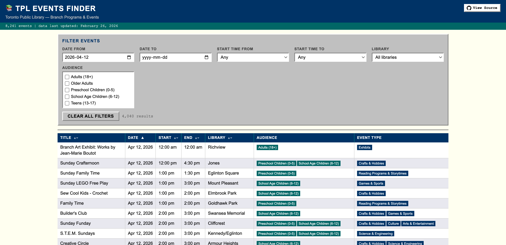
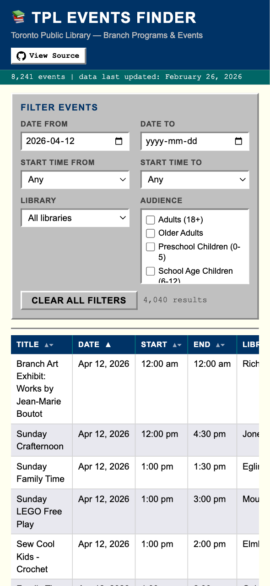

# TPL Events Finder

**[&#x1F517; Live site](https://jentacularjava.github.io/tpl_events/)** &nbsp;&nbsp;   

> A community-built tool to search and filter Toronto Public Library branch programs and events by date, time, and location.

---

## What it does

The Toronto Public Library website is hard to search if you're looking for events across different library locations. This tool pulls the full event feed from Toronto Open Data, pre-processes it daily via GitHub Actions, and serves it as a fast, filterable table with no login, no tracking, and no frameworks.

**Filters:** date range, start time window, library branch 
**Sorting:** click any column header  
**Data freshness:** pipeline runs daily and skips commits when upstream data has not changed

---

## Live site

**[https://jentacularjava.github.io/tpl_events/](https://jentacularjava.github.io/tpl_events/)**

## Screenshots
<a href="screenshot_desktop.png">
  
</a>
<a href="screenshot_mobile.png">
  
</a>

---

## Project structure

```
/
  index.html              Single-file frontend (zero dependencies)
  humans.txt              Author attribution
  data/
    events.json           Pre-processed events data (auto-updated)
    meta.json             Last update timestamp and record count
  pipeline/
    fetch_events.py       Data pipeline script
    pyproject.toml        uv project config and dependencies
    uv.lock               Lockfile (committed for reproducibility)
  .github/
    workflows/
      update_data.yml     Daily GitHub Actions workflow
```

---

## Local development

Requires [uv](https://docs.astral.sh/uv/).

```bash
# Install dependencies
cd pipeline
uv sync

# Run the pipeline locally
uv run fetch_events.py
```

To preview the frontend locally you need a simple HTTP server (opening `index.html` directly as a file will fail due to the `fetch()` call):

```bash
# From the repo root
python3 -m http.server 8000
# Then open http://localhost:8000
```

---

## Data source

Events data is sourced from the [Toronto Open Data portal](https://open.toronto.ca/dataset/library-branch-programs-and-events-feed/) and refreshed daily.

Pipeline notes:

- Exits early with no commit if the upstream `LastUpdatedOn` field has not changed since the last run
- Only `ACTIVE` status events are included
- Duplicate `EventID` values in the source data are deduplicated on import (first occurrence kept)

---

## Notes

This tool is not affiliated with or endorsed by Toronto Public Library.